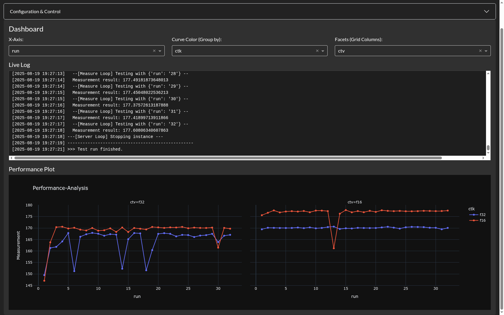

# brute-llama

**brute-llama** is a handy performance testing and analysis tool, particularly focused on llama.cpp llama-server configuration. It provides a web-based interface to configure, run, and visualize performance tests for various model configurations.

## Features

- **Web-based Interface**: Interactive dashboard built with Dash and Dash Bootstrap Components
- **Configurable Test Parameters**: Define server and measurement parameters with flexible templates
- **Performance Visualization**: Real-time plotting of performance metrics using Plotly
- **Configuration Management**: Save and load test configurations as YAML files

## Installation

1. **Clone the repository**:
   ```bash
   git clone https://github.com/yourusername/brute-llama.git
   cd brute-llama
   ```

2. **Install dependencies**:
   ```bash
   pip install -r requirements.txt
   ```

3. **Create required directories**:
   ```bash
   mkdir -p configs data
   ```

## Configuration

The application uses YAML configuration files stored in the `configs/` directory. Each configuration file contains:

- `server_template`: Command template to start the model server
- `measure_template`: Command template to measure performance
- `server_url`: URL for health checks
- `server_params`: Parameters for server configuration
- `measure_params`: Parameters for measurement configuration

Example configuration (`configs/example.yaml`):
```yaml
server_template: /usr/local/bin/llama-server --host 0.0.0.0 --port 8048 -fa -sm none --no-mmap -ngl 99 -m /data/disk1/models/gemma-3/gemma-3-270m-it-Q8_0.gguf -mg 0 -ctk q8_0 -ctv q8_0 --jinja -ts {{ts}}
measure_template: "curl -s http://192.168.178.56:8048/v1/chat/completions -H \"Content-Type: application/json\" -H \"Authorization: Bearer none\" -d '{\"model\": \"anymodel\", \"messages\": [{\"role\": \"system\", \"content\": \"give short answers.\"}, {\"role\": \"user\", \"content\": \"Hi.\"}] }' | jq '.timings.predicted_per_second'"
server_url: 192.168.178.56:8048
debug_mode: []
server_params:
  - id: param1
    name: ts
    values: "1,1,1,1,1;1,1,1,1,0"
measure_params:
  - id: param2
    name: run
    values: "1;2;3;4;5"
```

## Usage

1. **Start the application**:
   ```bash
   python brute-llama.py
   ```

2. **Access the web interface**:
   Open your browser and navigate to `http://localhost:9111`

3. **Configure your test**:
   - Load an existing configuration or create a new one
   - Define server and measurement parameters
   - Set the server URL and debug mode

4. **Run tests**:
   - Click "START TEST RUN" to begin performance testing
   - Monitor real-time logs and performance metrics
   - Use "CANCEL TEST RUN" to stop ongoing tests

5. **Save configurations**:
   - Enter a name and click "Save" to store your configuration
   - Load saved configurations from the dropdown menu

## Screenshots


*Example of the brute-llama dashboard showing performance metrics*

## License

This project is licensed under the MIT License - see the [LICENSE](LICENSE) file for details.
